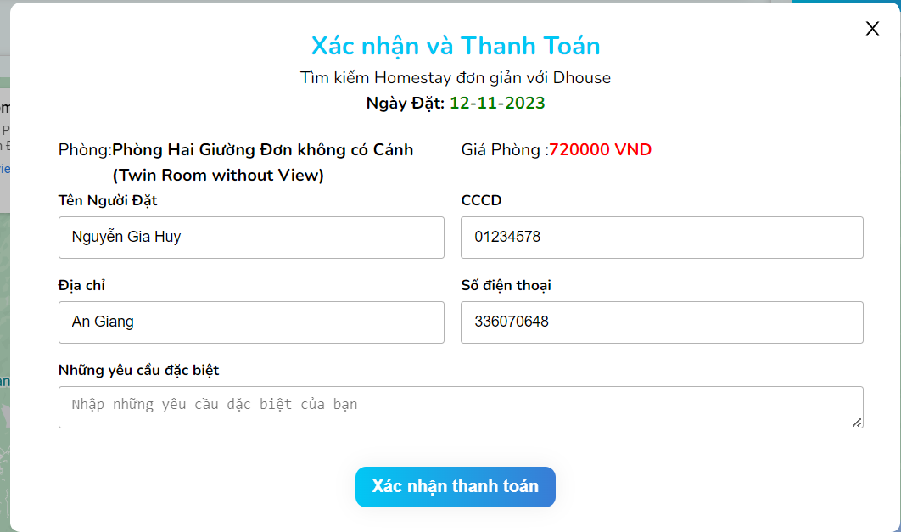

# Booking & Hotel Management
  * Build with: ReactJs, NodeJs, ExpressJS, MongoDB.
## Use Cases
  * Create, Update, Delete, Get Room
  * Create, Update, Delete, Get Room Booking
  * Create, Update, Delete, Get Employee
  * Create, Update, Delete, Get Room Type
  * Create, Update, Delete, Get Customer
  * Create, Update, Delete, Get Branch
  * Register, Login as Member for User Client and Login as Admin for Admin Dashboard
  * Checkout and Manage Order.
## Admin Dashboard
### Admin
* We can login to the admin dashboard and start to manage
<!--  -->

* Display the admin dashboard
<!--  -->

* Receptionist makes direct booking

<!--  -->
<!--  -->

<!--  -->
* Admin make a receipt and revenue statistics

<!--  -->
* Manage Room

<!--  -->
Add room along with room type

* Add room

<!--  -->
* Add room type
<!-- ![roomtype] -->

<!--  -->
**Branch Manager

<!--  -->
### Client
** User can register and login to booking room

<!--  -->
** User Interface

<!--  -->
** See room detail

<!--  -->

# Example Booking And Process
User login in to the user interface after then find room and booking

user fill in all information on form and checkout room.

